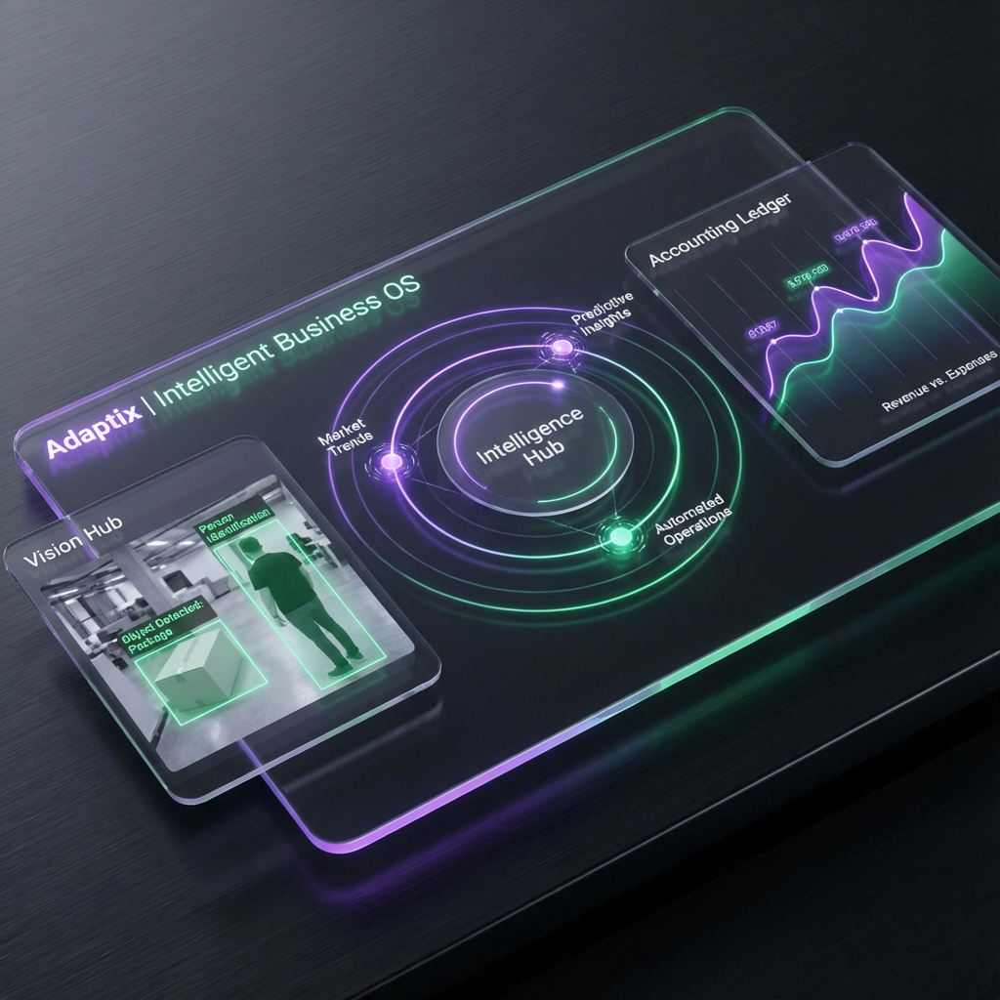

# Adaptix | Intelligent Business OS



**The Next-Generation Intelligence-Driven Business Operating System for the Modern Enterprise.**

---

## 🚀 Overview

**Adaptix** is a revolutionary, dynamic platform that evolves alongside your business. Unlike traditional ERPs, Adaptix is built on an **Intelligence-First** architecture, natively integrating AI Vision, Predictive Analytics, and an Autonomous Assistant into the daily operational flow.

Whether you manage a global retail chain, a precision manufacturing plant, or a sports venue, Adaptix adapts its core logic and UI to fit your industry perfectly.

**[Explore the Visual Gallery →](GALLERY.md)**

## 🌟 Core Pillars of Intelligence

### 1. Vision Hub (AI Visual Checkout)

- **Object Detection**: Automate checkout by identifying products through camera feeds.
- **Visual Sync**: Seamlessly sync detected items from the AI Cart to the POS system.
- **Security Monitoring**: Real-time visual tracking for retail security.

### 2. Predictive Supply Chain

- **Stockout Prediction**: AI identifies low-stock items before they run out.
- **Auto-Procurement**: The system proactively suggests or generates Purchase Orders based on demand forecasts.
- **Inventory Optimization**: Dynamic reorder points tailored to seasonal trends.

### 3. Financial Excellence

- **Real-time Accounting**: Automatic Journal Entry generation for every sale, purchase, and payment.
- **Double-Entry Ledger**: Enterprise-grade financial transparency with multi-currency support.
- **Automated P&L**: Instant insights into business health.

### 4. Human-Centric AI Assistant

- **Bilingual Interface**: Seamlessly switch between English and Bengali.
- **Smart Queries**: Ask the AI assistant for sales reports, stock status, or employee details in natural language.

---

## 🛠 Tech Stack

- **Backend**: Microservices architecture using Python 3.12 (Django) and Node.js.
- **Frontend**: Next.js 14+ with TailwindCSS for a premium, responsive glassmorphism UI.
- **Database**: PostgreSQL (Service-isolated architecture).
- **Messaging**: RabbitMQ for event-driven inter-service communication.
- **AI/ML**: Integrated Vision Processing and Predictive Modeling.
- **Infrastructure**: Dockerized environment with Kong API Gateway.

---

## ⚡ Quick Start

### Prerequisites

- Docker & Docker Compose (v2.0+)

### Launch the OS

```bash
# 1. Clone the repository
git clone https://github.com/taposhsarker38/adaptix-erp.git
cd adaptix

# 2. Run the deployment script
./scripts/up.sh

# 3. Explore the Dashboard
# UI: http://localhost:3000
# API Gateway: http://localhost:8000
```

---

## 📚 Ecosystem Architecture

Adaptix is composed of **15+ decoupled microservices** working in harmony:

| Domain           | Services                       | Responsibilities                            |
| :--------------- | :----------------------------- | :------------------------------------------ |
| **Intelligence** | `ai-service`, `vision-hub`     | Forecasting, Object Detection, Assistant.   |
| **Operations**   | `pos`, `inventory`, `purchase` | Sales, Stock Management, Procurement.       |
| **Finance**      | `accounting`, `payment`        | Ledger, Journaling, Payment Gateways.       |
| **People**       | `hrms`, `auth-service`         | Payroll, Identity, RBAC.                    |
| **Common**       | `notification`, `reporting`    | Multi-channel Alerts, PDF/Excel generation. |

---

## 🧪 Testing & Quality

Quality is built-in with comprehensive test suites for every service.

```bash
# Run all service tests
make test
```

---

**Adaptix — The Intelligent OS for your Business Evolution.**
