# Adaptix ERP - Complete System ER Diagram

This comprehensive diagram visualizes the data architecture across all 18+ microservices.
Dashed lines indicate Logical Relationships (UUID references) across service boundaries. Solid lines indicate physical foreign keys.

```mermaid
erDiagram
    %% ==========================================
    %% 1. AUTH & TENANCY SERVICE
    %% ==========================================
    COMPANY ||--|{ USER : "has employees/users"
    COMPANY ||--|{ DEPARTMENT : defines
    COMPANY ||--|{ DESIGNATION : defines
    DEPARTMENT ||--|{ EMPLOYEE : contains
    ROLE ||--|{ USER : assigned_to

    %% ==========================================
    %% 2. PRODUCT SERVICE
    %% ==========================================
    CATEGORY ||--|{ PRODUCT : categorizes
    BRAND ||--|{ PRODUCT : manufactures
    PRODUCT ||--|{ PRODUCT_VARIANT : "has variants (sku)"
    PRODUCT_VARIANT }|--|| UNIT : "measured in"

    %% ==========================================
    %% 3. INVENTORY SERVICE
    %% ==========================================
    WAREHOUSE ||--|{ STOCK : stores
    STOCK }|--|| PRODUCT_VARIANT : "tracks specific item"
    STOCK ||--|{ BATCH : "has batches (exp)"
    STOCK ||--|{ STOCK_SERIAL : "has serials (unique)"
    STOCK ||--|{ STOCK_TRANSACTION : "history log"
    STOCK ||--|{ UOM_CONVERSION : "unit conversions"

    %% ==========================================
    %% 4. PURCHASE (PROCUREMENT) SERVICE
    %% ==========================================
    VENDOR ||--|{ RFQ : receives
    RFQ ||--|{ VENDOR_QUOTE : "bids received"
    VENDOR_QUOTE ||--|| PURCHASE_ORDER : "winning bid -> PO"
    PURCHASE_ORDER ||--|{ PURCHASE_ORDER_ITEM : contains
    PURCHASE_ORDER_ITEM }|--|| PRODUCT_VARIANT : "orders item"

    %% ==========================================
    %% 5. POS (SALES) SERVICE
    %% ==========================================
    POS_SESSION ||--|{ ORDER : "session has orders"
    ORDER ||--|{ ORDER_ITEM : contains
    ORDER ||--|{ ORDER_RETURN : "can have returns"
    ORDER_ITEM }|--|| PRODUCT_VARIANT : "sells"
    ORDER }|--|| CUSTOMER : "sold to"

    %% ==========================================
    %% 6. PAYMENT SERVICE
    %% ==========================================
    ORDER ||--|{ PAYMENT : "paid via"
    PAYMENT ||--|{ TRANSACTION : "gateway logs"
    EMI_PLAN ||--|{ EMI_SCHEDULE : "defines terms"
    ORDER ||--|| EMI_SCHEDULE : "if financed"
    EMI_SCHEDULE ||--|{ EMI_INSTALLMENT : "monthly dues"

    %% ==========================================
    %% 7. CRM & CUSTOMER SERVICE
    %% ==========================================
    LEAD ||--|| OPPORTUNITY : "converts to"
    OPPORTUNITY }|--|| CUSTOMER : "belongs to"
    STAGE ||--|{ LEAD : "pipeline status"
    CUSTOMER ||--|| LOYALTY_ACCOUNT : "has points"
    LOYALTY_PROGRAM ||--|{ LOYALTY_TIER : "defines tiers"
    LOYALTY_ACCOUNT }|--|| LOYALTY_TIER : "current status"
    LOYALTY_ACCOUNT ||--|{ LOYALTY_TRANSACTION : "history"

    %% ==========================================
    %% 8. LOGISTICS SERVICE
    %% ==========================================
    VEHICLE ||--|{ DELIVERY_ROUTE : assigned_to
    DELIVERY_ROUTE ||--|{ SHIPMENT : "delivers"
    ORDER ||--|{ SHIPMENT : "fulfilled by"
    SHIPMENT }|--|| EMPLOYEE : "driver (logical)"

    %% ==========================================
    %% 9. HRMS SERVICE
    %% ==========================================
    EMPLOYEE ||--|| USER : "auth login"
    EMPLOYEE }|--|| DEPARTMENT : "works in"
    EMPLOYEE }|--|| DESIGNATION : "holds title"
    EMPLOYEE |{--|| SHIFT : "assigned shift"
    EMPLOYEE ||--|{ ATTENDANCE : "logs"
    EMPLOYEE ||--|{ LEAVE_REQUEST : "requests"
    EMPLOYEE ||--|{ PAYROLL : "receives"

    %% ==========================================
    %% 10. ACCOUNTING SERVICE
    %% ==========================================
    ACCOUNT_GROUP ||--|{ CHART_OF_ACCOUNT : "groups"
    CHART_OF_ACCOUNT ||--|{ JOURNAL_ITEM : "ledger entries"
    JOURNAL_ENTRY ||--|{ JOURNAL_ITEM : "contains"
    JOURNAL_ENTRY }|--|| ORDER : "sales entry (ref)"
    JOURNAL_ENTRY }|--|| PURCHASE_ORDER : "purchase entry (ref)"

    %% ==========================================
    %% 11. MANUFACTURING SERVICE
    %% ==========================================
    WORK_CENTER ||--|{ PRODUCTION_ORDER : "processes"
    BILL_OF_MATERIAL ||--|{ BOM_ITEM : "recipe"
    BILL_OF_MATERIAL }|--|| PRODUCT_VARIANT : "makes product"
    PRODUCTION_ORDER }|--|| BILL_OF_MATERIAL : "uses recipe"
    PRODUCTION_ORDER ||--|| PRODUCT_VARIANT : "produces"

    %% ==========================================
    %% 12. ASSET SERVICE
    %% ==========================================
    ASSET_CATEGORY ||--|{ ASSET : "classifies"
    ASSET ||--|{ DEPRECIATION_SCHEDULE : "loses value"
    ASSET }|--|| EMPLOYEE : "assigned to"

    %% ==========================================
    %% 13. PROMOTION SERVICE
    %% ==========================================
    COUPON }|--|| ORDER : "applied to"

    %% ==========================================
    %% 14. QUALITY SERVICE
    %% ==========================================
    QUALITY_STANDARD }|--|| PRODUCT : "defines criteria"
    INSPECTION ||--|{ TEST_RESULT : "results"
    TEST_RESULT }|--|| QUALITY_STANDARD : "checked against"
    INSPECTION }|--|| PRODUCTION_ORDER : "inspects production"
    INSPECTION }|--|| STOCK : "inspects inventory"

    %% ==========================================
    %% 15. INTELLIGENCE SERVICE
    %% ==========================================
    SALES_HISTORY }|--|| PRODUCT_VARIANT : "daily aggregates"
    FORECAST }|--|| PRODUCT_VARIANT : "future demand"

    %% ==========================================
    %% 16. REPORTING SERVICE
    %% ==========================================
    DAILY_SALES }|--|| COMPANY : "financial summary"
    TOP_PRODUCT }|--|| PRODUCT : "best sellers"

    %% ==========================================
    %% 17. NOTIFICATION SERVICE
    %% ==========================================
    ALERT }|--|| USER : "notifies"
    ALERT }|--|| ORDER : "linked to (ref)"
```

## Service Interactions & Data Flow

### Core Business Flow

1. **Sales**: `ORDER` (POS) -> `LOYALTY_TRANSACTION` (rewards) -> `PAYMENT` (cash/card) -> `JOURNAL_ENTRY` (Accounting) -> `SHIPMENT` (logistics).
2. **Supply Chain**: `FORECAST` (Intelligence) -> `RFQ` (Purchase) -> `PO` -> `STOCK` (Inventory) -> `PRODUCTION_ORDER` (Manufacturing).

### Intelligence Layer

- **Forecasting**: Uses `SALES_HISTORY` (aggregated from POS) to generate `FORECAST` models, which inform `RFQ` (Purchase) needs.
- **Reporting**: Aggregates `DAILY_SALES` and `TOP_PRODUCT` for executive dashboards.

### HR & Admin

- **Workforce**: `EMPLOYEE` manages `SHIFT` and `ATTENDANCE`, while generating `PAYROLL`.
- **Assets**: `ASSET` tracking linked to `EMPLOYEE` assignments and `DEPRECIATION` schedules for Accounting.
